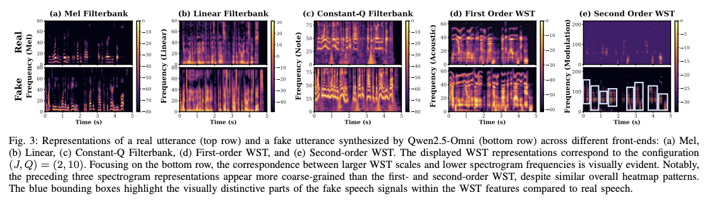

# WST-X-Series: Wavelet Scattering Transform for Interpretable Speech Deepfake Detection

[](https://arxiv.org/abs/2602.02980)

Submitted to IEEE Signal Processing Letters



## Supplementary Materials

This section provides the complete experimental results referenced in Footnote 1 of the paper.

---

#### Experiment 1 — Energy Distribution of Wavelet Scattering Coefficients

To provide a physically intuitive justification for why second-order scattering (`M = 2`) is sufficient, we analyze how the scattering energy is distributed across different orders of the 1D WST.

**Definitions.** We define the *energy* of a scattering coefficient as the squared ℓ₂-norm of its output, and the *energy proportion* at order *m* as the fraction of the total scattering energy contributed by all *m*-th order paths. Formally:

$$E_m(x) = \sum_{p \in \mathcal{P}_m} \| S_J[p] x \|_2^2,$$

$$\rho_m(x) = \frac{E_m(x)}{\sum_{m'=0}^{M} E_{m'}(x)} \times 100\%.$$

This normalization ensures that $\sum_{m=0}^{M} \rho_m(x) = 100\%$ for each sample, making the proportions directly comparable across scattering orders and averaging scales *J*.

**Setup.** We compute ρ_m for the 1D WST using `Q = 10` across varying averaging scales `J ∈ {2, 4, 6, 8}` on 1,000 test samples (500 real, 500 fake).

<p align="center"><b>Table 1.</b> Energy proportion (%) captured by each scattering order of the 1D WST (<code>Q = 10</code>).</p>

<div align="center">

| *J* | M=1 (Real) | M=1 (Fake) | M=2 (Real) | M=2 (Fake) | M=3 (Real) | M=3 (Fake) |
|:---:|:----------:|:----------:|:----------:|:----------:|:----------:|:----------:|
| 2 | 38.64 ± 12.62 | 40.62 ± 10.81 | 61.36 ± 12.62 | 59.38 ± 10.81 | 0.00 | 0.00 |
| 4 | 37.85 ± 28.00 | 42.37 ± 27.68 | 62.08 ± 27.97 | 57.57 ± 27.65 | 0.07 ± 0.07 | 0.07 ± 0.05 |
| 6 |  6.63 ± 18.17 |  5.67 ± 15.79 | 93.20 ± 18.13 | 94.14 ± 15.75 | 0.17 ± 0.10 | 0.18 ± 0.09 |
| 8 |  2.89 ± 12.09 |  2.18 ±  9.53 | 96.94 ± 12.07 | 97.63 ±  9.51 | 0.17 ± 0.10 | 0.19 ± 0.08 |

</div>

**Findings.** The results indicate a rapid energy decay across scattering orders. At `J = 8`, 2nd-order coefficients capture over 97% of the total energy, while 3rd-order coefficients account for less than 0.2%. Together, *M = 1* and *M = 2* collectively capture nearly all (>99%) of the scattering energy. While the performance gain from *M = 1* to *M = 2* shows that even low-energy coefficients can carry discriminative information, this does not hold for *M = 3*: the additionally included coefficients carry negligible energy and provide limited new discriminative cues, which we hypothesize contributes to overfitting — consistent with the performance degradation observed at *M = 3* in Table I of the manuscript.

---

#### Experiment 2 — Quantitative SHAP Explainability of Wavelet Scattering Coefficients

To quantitatively substantiate the interpretability of the WST-X front-end, we perform SHAP (SHapley Additive exPlanations) [1] analysis on the 1D WST scattering coefficients with `J = 2, Q = 10`. SHAP is a feature-attribution method grounded in cooperative game theory [2].

**Setup.** We extract statistical features (mean, standard deviation, skewness, and kurtosis) from each coefficient across 1,000 test samples, and train a gradient boosting classifier to obtain SHAP values.

<p align="center"><b>Table 2.</b> Mean absolute SHAP values for each 1D WST scattering coefficient (<code>J = 2, Q = 10</code>), where ξ denotes the normalized center frequency and Hz = ξ × f<sub>s</sub> (f<sub>s</sub> = 16,000 Hz). Larger SHAP values indicate features that more strongly influence the detection decisions. Top two scattering coefficients are in <b>bold</b>.</p>

<div align="center">

| Scattering Coefficient | SHAP Value |
|:----------------------:|:----------:|
| **1st-order (spectral envelope)**     | **2.45** |
| 2nd-order, ξ = 0.0019 (30 Hz)         | 0.80 |
| 2nd-order, ξ = 0.0037 (60 Hz)         | 0.36 |
| 2nd-order, ξ = 0.0056 (90 Hz)         | 0.29 |
| 2nd-order, ξ = 0.0075 (119 Hz)        | 0.37 |
| 2nd-order, ξ = 0.0093 (149 Hz)        | 0.41 |
| 2nd-order, ξ = 0.0112 (179 Hz)        | 0.40 |
| 2nd-order, ξ = 0.0131 (209 Hz)        | 0.38 |
| 2nd-order, ξ = 0.0149 (239 Hz)        | 0.76 |
| **2nd-order, ξ = 0.0168 (269 Hz)**    | **1.63** |

</div>

**Findings.** The first-order coefficients, which jointly encode the spectral envelope, attain the highest aggregated SHAP value (2.45), followed by the second-order coefficients at the highest and lowest modulation frequencies in the analyzed range (269 Hz with SHAP 1.63, and 30 Hz with SHAP 0.80). Mid-frequency second-order coefficients (60–149 Hz) contribute relatively less. Unlike SSL features, whose individual dimensions lack direct physical interpretation, each WST coefficient corresponds to a specific modulation frequency determined by ξ, enabling a physical interpretation of the deepfake detection decision.

**References.**

[1] S. M. Lundberg and S.-I. Lee, "A unified approach to interpreting model predictions," in *Advances in Neural Information Processing Systems (NeurIPS)*, vol. 30, 2017, pp. 4765–4774.

[2] L. S. Shapley, "A value for n-person games," in *Contributions to the Theory of Games, Volume II*, Princeton University Press, 1953, pp. 307–317.

---

## Citation

If you find our repository valuable for your work, please consider citing our paper:

```bibtex
@misc{xuan2026wstxserieswaveletscattering,
      title={WST-X Series: Wavelet Scattering Transform for Interpretable Speech Deepfake Detection}, 
      author={Xi Xuan and others},
      year={2026},
      eprint={2602.02980},
      archivePrefix={arXiv},
      primaryClass={eess.AS},
      url={https://arxiv.org/abs/2602.02980}, 
}
